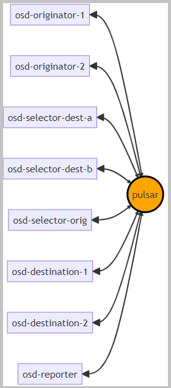
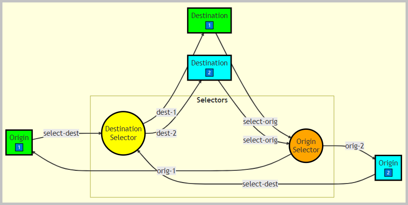
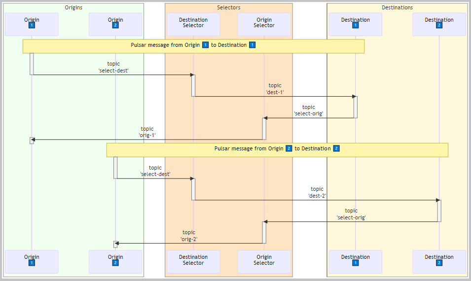
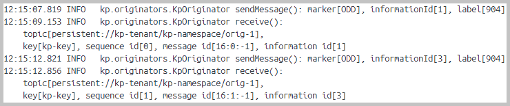
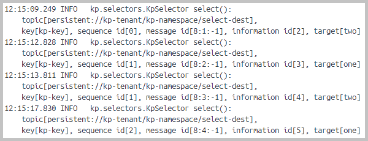
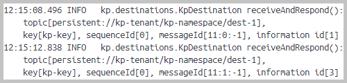
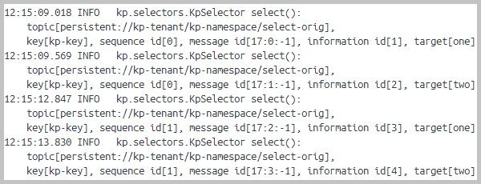
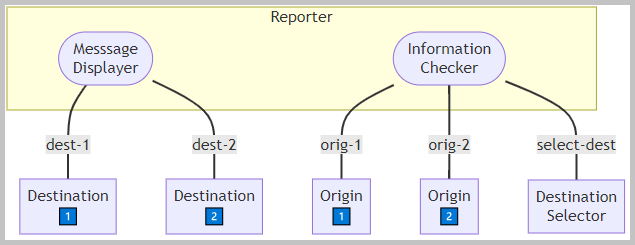

<!DOCTYPE html>
<HTML lang="en">
<META charset="UTF-8">
<BODY>

<H2 id="contents">Study21 README Contents</H2>
<H3 id="top">Research the Pulsar message broker</H3>

<a href="https://pulsar.apache.org/docs/3.1.x/">Apache Pulsar</a> is a distributed messaging and streaming platform.
The <a href="https://pulsar.apache.org/docs/3.1.x/reference-terminology/#concepts">Pulsar terminology</a>. 

This application uses classes from the <i>pulsar-client-api</i> library:

<ul>
 <li>PulsarClient</li>
 <li>Producer</li>
 <li>Consumer</li>
 <li>Reader</li>
 <li>Message</li>
</ul>

The sections of this project:

<OL>
<LI><a href="#ONE"><b>Docker Build</b></a></LI>
<LI><a href="#TWO"><b>Originators, Selectors, Destinations</b></a></LI>
<LI><a href="#THREE"><b>Reporter with Information Checker and Message Displayer</b></a></LI>
<LI><a href="#FOUR"><b>Docker and Pulsar Scripts</b></a></LI>
</OL>

Java source code. Packages: 
 

    <i>application sources</i>&nbsp;:&nbsp;
	<a href="https://github.com/k1729p/Study21/tree/main/src/main/java/kp">kp</a> 

    <i>test sources</i>&nbsp;:&nbsp;
	<a href="https://github.com/k1729p/Study21/tree/main/src/test/java/kp">kp</a> 

 

    <a href="http://htmlpreview.github.io/?https://github.com/k1729p/Study21/blob/main/docs/apidocs/index.html">
	Java API Documentation</a> 

<H3 id="ONE">❶ Docker Build</H3>

Action: 
 
 1. With batch file
 <a href="https://github.com/k1729p/Study21/blob/main/0_batch/01%20Docker%20Pulsar.bat"><I>"01 Docker Pulsar.bat"</I></a> install and start the container with the Pulsar. 
 2. With batch file
 <a href="https://github.com/k1729p/Study21/blob/main/0_batch/02%20Pulsar%20create%20tenant%20and%20namespace.bat">
 <I>"02 Pulsar create tenant and namespace.bat"></I></a> create the tenant and the namespace. 
 3. With batch file 
 <a href="https://github.com/k1729p/Study21/blob/main/0_batch/03%20Docker%20build%20and%20run.bat"><I>"03 Docker build and run.bat"></I></a> build the image and 
start the container with the application. 

1.1. Docker image is built using these files:
<a href="https://raw.githubusercontent.com/k1729p/Study21/main/docker-config/Dockerfile"><b>Dockerfile</b></a> and
<a href="https://raw.githubusercontent.com/k1729p/Study21/main/docker-config/compose.yaml"><b>compose.yaml</b></a>.

 

<I>The message flows between the containers in Docker.</I>

The <a href="images/ScreenshotDockerContainers.png">screenshot</a> of the created Docker containers.

1.2. The integration test for the message exchange between 'KpOriginator', 'KpSelector', and 'KpDestination'. 
It uses the 'PulsarContainer'.
This is the <a href="https://java.testcontainers.org/modules/pulsar/">Apache Pulsar Module</a> from 
<a href="https://java.testcontainers.org">Testcontainers for Java</a>.

<a href="#top">Back to the top of the page</a>

<H3 id="TWO">❷ Originators, Selectors, Destinations</H3>

2.1. All received messages are acknowledged. For the exceptions it is used the negative acknowledge. 
For the payload send in Pulsar 'Message' it is used the 'Information' object.
The 'Information' contains the list of the 'Department' objects.
The 'Department' contains the list of the 'Employee' objects.

 

<I>The flowchart diagram for two origins, destination selector, origin selector, and two destinations.</I>

 

<I>The sequence diagram for two origins, destination selector, origin selector, and two destinations.</I>

2.2. It is implemented the fail-over logic.
There are two identical Docker containers: <b>osd-selector-dest-a</b> and 
<b>osd-selector-dest-b</b>. They have the consumer subscribed with the Fail-over subscription type.
Pulsar configures these two containers and makes one consumer active and thr other consumer on standby.

The fail-over test steps:

<ul>
 <li>container with the active consumer is manually stopped in Docker</li>
 <li>it causes the active consumer to be disconnected</li>
 <li>Pulsar makes the standby consumer active</li>
 <li>this activated by Pulsar consumer starts consuming messages</li>
</ul>

2.3. The producers in the container <b>osd-originator-1</b> and <b>osd-originator-2</b> produce messages to the topic '<b>select-dest</b>'. 
The producer method:
<a href="https://github.com/k1729p/Study21/blob/main/src/main/java/kp/originators/KpOriginator.java#L72">
kp.originators.KpOriginator::sendMessage</a>.

 

<I>The log from the container <b>osd-originator-1</b>.</I>

2.4. The destination selectors in the containers <b>osd-selector-dest-a</b> and <b>osd-selector-dest-b</b> 
direct the messages from the destination selector topic '<b>select-dest</b>' to the destination topics '<b>dest-1</b>' and '<b>dest-2</b>'. 
In these two selectors Pulsar makes one consumer active and the other consumer on standby.

The message selection logic:

<ul>
 <li>a message with odd information id goes to '<b>dest-1</b>'</li>
 <li>a message with even information id goes to '<b>dest-2</b>'</li>
</ul>

The consumer and the producer method: 
<a href="https://github.com/k1729p/Study21/blob/main/src/main/java/kp/selectors/KpSelector.java#L71">
kp.selectors.KpSelector::select</a>.

 

<I>The log from the container <b>osd-selector-dest-a</b>.</I>

2.5. The consumer in the container <b>osd-destination-1</b> consumes messages from the topic '<b>dest-1</b>'. 
The consumer in the container <b>osd-destination-2</b> consumes messages from the topic '<b>dest-2</b>'. 
They send the response to the topic '<b>select-orig</b>'. 
Received 'Information' is approved or rejected (logic with flip-flop sequence).

The consumer method:
<a href="https://github.com/k1729p/Study21/blob/main/src/main/java/kp/destinations/KpDestination.java#L70">
kp.destinations.KpDestination::receiveAndRespond</a>.

 

<I>The log from the container <b>osd-destination-1</b>.</I>

2.6. The origin selector in the container <b>osd-selector-orig</b> directs
 the messages from the origin selector topic '<b>select-orig</b>' to the origin topics '<b>orig-1</b>' and '<b>orig-2</b>'.

The message selection logic:

<ul>
 <li>messages with odd information id go to '<b>orig-1</b>'</li>
 <li>messages with even information id go to '<b>orig-2</b>'</li>
</ul>

 

<I>The log from the container <b>osd-selector-orig</b>.</I>

2.7. The consumer in the container <b>osd-originator-1</b> consumes messages from the topic '<b>orig-1</b>. 
The consumer in the container <b>osd-originator-2</b> consumes messages from the topic '<b>orig-2</b>.

The consumer method:
<a href="https://github.com/k1729p/Study21/blob/main/src/main/java/kp/originators/KpOriginator.java#L99">
kp.originators.KpOriginator::receive</a>.

The relevant log from the container <b>osd-originator-1</b> is presented in point 2.1 above.

<a href="#top">Back to the top of the page</a>

<H3 id="THREE">❸ Reporter with Information Checker and Message Displayer</H3>

The reporter uses the Pulsar Reader.

Action: 
 
 1. With batch file
 <a href="https://github.com/k1729p/Study21/blob/main/0_batch/04%20Docker%20start%20reporter.bat"><I>"04 Docker start reporter.bat"</I></a> start the reporter. 

 

<I>The reporter diagram</I>

3.1. The reporter checks the 'Information' in two messages. One message is from the destination topic and the other message is from the origin topic.

<ol>
 <li>searches for the Pulsar messages in the topic '<b>select-dest</b>'</li>
 <li>for checking, it selects the message from the middle of the received list</li>
 <li>this is the source of expected 'Information'</li>
 <li>searches for the related message in topics '<b>orig-1</b>' and '<b>orig-2</b>'</li>
 <li>this is the source of actual 'Information'</li>
 <li>compares the expected 'Information' with the actual 'Information'</li>
 <li>the 'Information' in both messages should be equal</li>
</ol>

The searching and checking method:
<a href="https://github.com/k1729p/Study21/blob/main/src/main/java/kp/reporters/KpReporter.java#L73">
kp.reporters.KpReporter::findAndCheck</a>.

The <a href="images/OsdReporter1.png">
<b>screenshot</b></a> of the log from the container <b>osd-reporter</b>.

3.2. The reporter displays the latest message. 

<ol>
 <li>in topic '<b>dest-1</b>' or topic '<b>dest-2</b>' it finds the latest message</li>
 <li>displays the 'Information'</li>
</ol>

The searching and displaying method:
<a href="https://github.com/k1729p/Study21/blob/main/src/main/java/kp/reporters/KpReporter.java#L188">
kp.reporters.KpReporter::findLatestAndDisplay</a>.

The <a href="images/OsdReporter2.png">
<b>screenshot</b></a> of the log from the container <b>osd-reporter</b>.

<a href="#top">Back to the top of the page</a>

<H3 id="FOUR">❹ Docker and Pulsar Scripts</H3>

Action: 
 
 1. With batch file
 <a href="https://github.com/k1729p/Study21/blob/main/0_batch/05%20Docker%20list.bat">
 <I>"05 Docker list.bat"</I></a> run the script for Docker to show the network and the containers. 
 2. With batch file
 <a href="https://github.com/k1729p/Study21/blob/main/0_batch/06%20Pulsar%20list.bat">
 <I>"06 Pulsar list.bat"</I></a> run the <b>pulsar-admin</b> to show the tenant, the namespace, the topics, and 
 the subscription. 

4.1. The batch file <I>"05 Docker list.bat"</I>. 
The <a href="images/DockerList.png">
<b>screenshot</b></a> of the console log from the run of the batch file <I>"05 Docker list.bat"</I>.

4.2. The batch file <I>"06 Pulsar list.bat"</I>. 
The <a href="images/PulsarList.png">
<b>screenshot</b></a> of the console log from the run of the batch file <I>"06 Pulsar list.bat"</I>.

<a href="#top">Back to the top of the page</a>

</BODY>
</HTML>