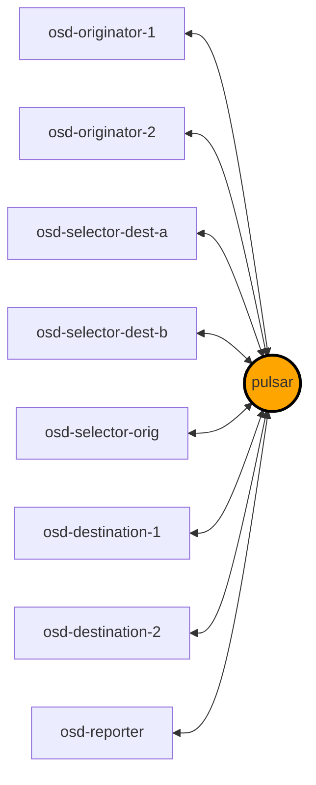
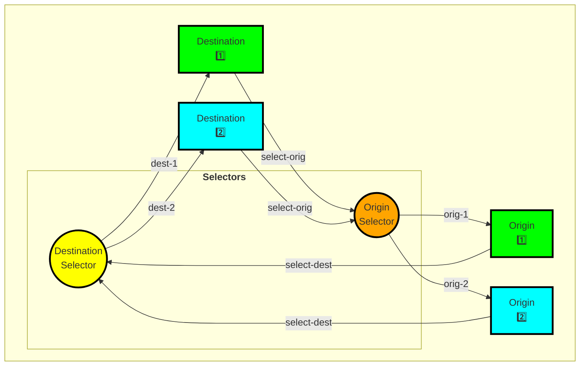
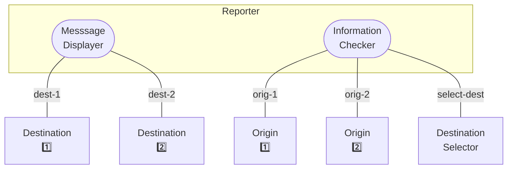

```mermaid
flowchart LR
P((pulsar)):::orangeBox
osd-originator-1 <--> P
osd-originator-2 <--> P
osd-selector-dest-a <--> P
osd-selector-dest-b <--> P
osd-selector-orig <--> P
osd-destination-1 <--> P
osd-destination-2 <--> P
osd-reporter <--> P
 
classDef orangeBox  fill:#ffa500,stroke:#000,stroke-width:3px
```

```mermaid
flowchart TD
subgraph " "
 direction LR
 O1["Origin
     1️⃣"]:::greenBox
 O2["Origin
     2️⃣"]:::cyanBox
 D1["Destination
     1️⃣"]:::greenBox
 D2["Destination
     2️⃣"]:::cyanBox
 subgraph "<b>Selectors</b>"
  SD(("Destination
      Selector")):::yellowBox
  SO(("Origin
      Selector")):::orangeBox
 end
end

O1 & O2 --"select-dest"--> SD
SD --"dest-1"--> D1
SD --"dest-2"--> D2
D1 & D2 --"select-orig"--> SO
SO --"orig-1"--> O1
SO --"orig-2"--> O2

classDef greenBox   fill:#00ff00,stroke:#000,stroke-width:3px
classDef cyanBox    fill:#00ffff,stroke:#000,stroke-width:3px
classDef yellowBox  fill:#ffff00,stroke:#000,stroke-width:3px
classDef orangeBox  fill:#ffa500,stroke:#000,stroke-width:3px
```

```mermaid
flowchart TB
subgraph Reporter
 MD(["Messsage
      Displayer"])
 CH(["Information
      Checker"])
end
O1["Origin
    1️⃣"]
O2["Origin
    2️⃣"]
SD["Destination
    Selector"]
D1["Destination
    1️⃣"]
D2["Destination
    2️⃣"]
MD --"dest-1"--- D1
MD --"dest-2"--- D2
CH --"orig-1"--- O1
CH --"orig-2"--- O2
CH --"select-dest"--- SD
```