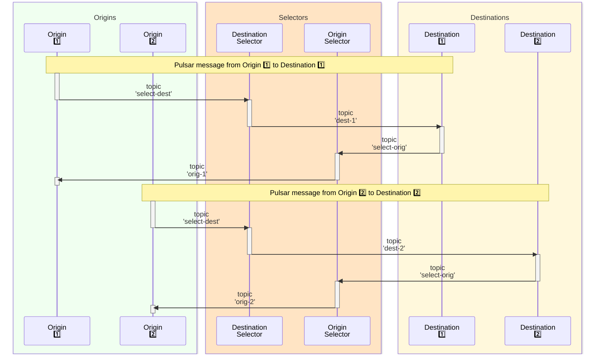

```mermaid
sequenceDiagram
box honeydew <br>Origins
 participant O1 as Origin<br/>1️⃣
 participant O2 as Origin<br/>2️⃣
end
box bisque <br>Selectors
 participant DS as Destination<br/>Selector
 participant OS as Origin<br/>Selector
end
box cornsilk <br>Destinations
 participant D1 as Destination<br/>1️⃣
 participant D2 as Destination<br/>2️⃣
end

Note over O1,D1: Pulsar message from Origin 1️⃣ to Destination 1️⃣
activate O1
O1 ->> DS: topic<br>'select-dest'
deactivate O1
activate DS
DS ->> D1: topic<br>'dest-1'
deactivate DS
activate D1
D1 ->> OS: topic<br>'select-orig'
deactivate D1
activate OS
OS ->> O1: topic<br>'orig-1'
deactivate OS
activate O1
deactivate O1

Note over O2,D2: Pulsar message from Origin 2️⃣ to Destination 2️⃣
activate O2
O2 ->> DS: topic<br>'select-dest'
deactivate O2
activate DS
DS ->> D2: topic<br>'dest-2'
deactivate DS
activate D2
D2 ->> OS: topic<br>'select-orig'
deactivate D2
activate OS
OS ->> O2: topic<br>'orig-2'
deactivate OS
activate O2
deactivate O2
```